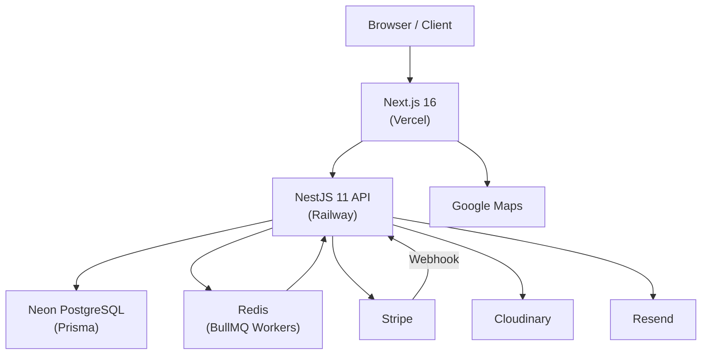

# RentPropertyUAE / Laugh & Lodge

A full-stack short-term rental and property-booking marketplace built for the Dubai and UAE market. The platform serves three distinct roles — guests, property owners, and operations staff — across a production-grade monorepo that handles inventory management, booking holds, Stripe-based payments, vendor onboarding, DTCM document compliance, and admin oversight workflows in a single cohesive system.

---

## Overview

RentPropertyUAE / Laugh & Lodge connects guests seeking short-stay accommodation in Dubai and the UAE with property owners who list and manage their inventory through a dedicated vendor portal. The platform manages the full lifecycle: property submission and DTCM document verification, admin review and approval, calendar and availability management, guest booking with a 15-minute hold, Stripe checkout, webhook-confirmed payment, post-stay review publication, and financial settlement through a double-entry ledger.

The backend is a NestJS 11 API deployed on Railway. The frontend is a Next.js 16 application on Vercel. PostgreSQL on Neon stores all application data via Prisma migrations. Redis and BullMQ handle async job processing and booking-expiry workers. Cloudinary manages media. Resend delivers transactional email. The platform supports English and Arabic with full RTL layout.

---

## Core Capabilities

### Guest Experience

- Property search and listing pages with filtering
- Property detail pages with image galleries and amenity breakdown
- Availability-aware date selection and quote calculation
- 15-minute booking hold to reserve inventory during checkout
- Stripe Checkout payment flow with webhook-confirmed booking confirmation
- Guest account portal: booking history, booking detail, refund requests, wishlist, documents, calendar, messages, notifications, profile
- Email verification at registration
- Cancellation and refund visibility
- Dubai tax itemization at checkout (service charge, municipality fee, tourism fee, VAT, Tourism Dirham)

### Vendor / Property Owner Portal

- Vendor onboarding with document verification workflow (Ownership Proof, Holiday Home Permit)
- Property creation, editing, preview, and submission workflow
- Property lifecycle: `DRAFT` → `UNDER_REVIEW` → `APPROVED` → `PUBLISHED`
- Activation payment required before a property goes live
- Cloudinary-based media upload with signed credentials
- Availability calendar and block-request management
- Booking management with per-booking detail view
- Vendor statements and payout history
- Operational tasks and work-orders
- In-platform messaging with guests
- Review management
- Analytics dashboard
- Maintenance request handling

### Admin Operations

- Property review queue with approve / reject / request-changes workflow
- Property edit and pricing override capabilities
- Vendor management and approval
- Booking and payment oversight
- Customer document verification
- Payout and statement management
- Refund review and processing
- Ops-task assignment and tracking
- Contact submission review
- In-platform messaging oversight
- Admin audit log — every admin mutation is recorded with actor, action, target, IP, and user-agent
- Block-request management
- Analytics

### Payments and Financial Controls

- Stripe integration with server-side PaymentIntent creation
- Raw-body webhook signature verification; no client-side payment confirmation is trusted
- Idempotency keys on all payment operations
- Refund amount capped to original payment value at the service layer
- Dubai five-component tax calculated server-side and snapshotted at booking
- AED as canonical pricing currency; FX rates stored as `Decimal(18,8)` with a daily scheduled refresh
- All monetary amounts stored as `INT` in minor currency units — no floating-point arithmetic
- Double-entry `LedgerEntry` model with `VendorStatement` and `Payout` chain
- Cascade delete blocked at the database level — bookings and payments cannot be lost by soft-deleting a user or property
- Promo code redemption is race-condition safe via atomic `updateMany` with a conditional `WHERE` clause

### Security and Production Hardening

- JWT access and refresh tokens with separate signing secrets
- Refresh token endpoint rate-limited to 10 attempts per minute per IP
- Role-based access control: `CUSTOMER`, `VENDOR`, `ADMIN`
- Request-scoped rate limiting on all endpoints via `@nestjs/throttler`
- CORS allowlist restricted to known production and staging origins
- Helmet security headers
- Swagger UI disabled in production; protected with HTTP Basic Auth if explicitly enabled
- Cloudinary signed-upload enforcement: API key and secret required when a cloud name is configured; application refuses to start without them in production
- Stripe production key validation: `sk_live_` prefix required in production; application refuses to start on `sk_test_` keys
- Image upload MIME allowlist (JPEG, PNG, WebP, HEIC, HEIF); SVG, GIF, and all non-image types rejected
- Extension mismatch attacks blocked (e.g. `.php` file with a spoofed `image/jpeg` MIME)
- Path traversal protection on all private document download endpoints
- Admin audit log with indexed query support (filterable by actor, action, target, date range)
- EventOutbox pattern for durable transactional email delivery that survives service restarts
- Correlation IDs generated server-side; incoming `X-Correlation-Id` headers are discarded
- Docker runtime as a non-root `nestjs` user (uid 1001)
- Prisma migrations separated from application startup via Railway release command

### Internationalization

- English and Arabic language support via `next-intl`
- RTL layout support via `tailwindcss-rtl`
- Locale-aware routing

---

## Architecture

The platform is structured as a pnpm monorepo managed with Turborepo. `apps/api` contains the NestJS backend. `apps/web` contains the Next.js frontend. Both share a root workspace for tooling dependencies.



The API is containerised using a three-stage Alpine Dockerfile. Railway runs `prisma migrate deploy` as a pre-deploy release command before routing traffic to the new revision, guaranteeing schema consistency on zero-downtime deploys. The web application is deployed directly to Vercel without a container.

---

## Technology Stack

| Layer | Technology | Version | Purpose |
|---|---|---|---|
| Frontend Framework | Next.js | 16.2.6 | SSR / App Router frontend |
| UI Library | React | 19.2.3 | Component rendering |
| Styling | Tailwind CSS | v4 | Utility-first CSS |
| Animation | Framer Motion | 12 | UI transitions |
| Backend Framework | NestJS | 11 | REST API |
| ORM | Prisma | 6.19.2 | Database access and migrations |
| Database | PostgreSQL (Neon) | — | Primary data store |
| Queue | BullMQ + ioredis | 5 / 5 | Async workers, booking expiry |
| Payments | Stripe | SDK v20 | Checkout, webhooks, refunds |
| Media | Cloudinary | SDK v2 | Signed media upload and delivery |
| Email | Resend | SDK v6 | Transactional email |
| i18n | next-intl | 4 | English / Arabic localisation |
| Maps | Google Maps JS API | — | Location features |
| Real-time | Socket.IO | 4 | In-platform messaging |
| Auth | Passport / JWT | — | Access + refresh token auth |
| Containerisation | Docker (Alpine) | node:22 | Three-stage production image |
| Monorepo | Turborepo + pnpm | 2 / 10 | Workspace orchestration |
| API host | Railway | — | NestJS deployment |
| Web host | Vercel | — | Next.js deployment |

---

## Repository Structure

```
booking-marketplace/
├── apps/
│   ├── api/                  # NestJS backend API
│   │   ├── prisma/           # Schema, migrations, seed scripts
│   │   └── src/              # Application source
│   │       ├── auth/         # JWT auth, email verification, guards
│   │       ├── bookings/     # Booking engine, hold system, cancellation policies
│   │       ├── modules/      # Payments, search, availability, reviews, promo, fx, finance, messaging
│   │       ├── portal/       # Customer, vendor, and admin portal endpoints
│   │       ├── infra/        # Cloudinary, Redis, BullMQ, cache invalidation
│   │       ├── workers/      # Booking completion and expiry workers
│   │       └── common/       # Upload filters, env validation, security utilities
│   └── web/                  # Next.js frontend
│       └── src/
│           ├── app/          # App Router pages (site, auth, customer, vendor, admin portals)
│           └── i18n/         # Locale request configuration
├── docs/
│   ├── audit/                # Full platform audit (19 documents)
│   └── hardening/
│       ├── p0/               # P0 critical-fix hardening report
│       └── p1/               # P1 public-launch hardening report and go/no-go checklist
├── infra/
│   └── docker/               # Local development docker-compose (Postgres + Redis)
├── Dockerfile                # Three-stage Alpine production image
├── railway.toml              # Railway deployment and release command config
├── nixpacks.toml             # Alternative nixpacks build config
├── pnpm-workspace.yaml       # pnpm workspace definition
├── turbo.json                # Turborepo pipeline config
└── package.json              # Root workspace manifest
```

---

## Getting Started

### Prerequisites

- Node.js 22
- pnpm 10.28.2 (`npm install -g pnpm@10.28.2`)
- PostgreSQL database (local or Neon)
- Redis instance (local via docker-compose or managed)
- Stripe account (use test mode for local development)
- Cloudinary account
- Resend account

### Install Dependencies

```bash
pnpm install
```

### Local Infrastructure

Start a local Postgres and Redis instance:

```bash
docker compose -f infra/docker/docker-compose.yml up -d
```

### Environment Setup

Create `.env` files for each app using the environment variable reference tables below. Do not commit real secrets.

### Database Setup

Generate the Prisma client:

```bash
pnpm --filter api prisma:generate
```

Apply migrations to your local database:

```bash
pnpm --filter api db:migrate:deploy
```

Optionally seed demo data:

```bash
pnpm --filter api db:seed
```

### Run Development Servers

API (with file-watch):

```bash
pnpm --filter api dev
```

Web:

```bash
pnpm --filter web dev
```

Both together via Turborepo:

```bash
pnpm dev
```

---

## Environment Variables

**Never commit real environment variables to the repository.**

### API (`apps/api/.env`)

| Variable | Purpose | Required |
|---|---|---|
| `DATABASE_URL` | PostgreSQL connection string | Yes |
| `REDIS_URL` | Redis connection URL for BullMQ | Yes |
| `JWT_ACCESS_SECRET` | Access token signing secret (min 32 chars) | Yes |
| `JWT_REFRESH_SECRET` | Refresh token signing secret (min 32 chars) | Yes |
| `STRIPE_SECRET_KEY` | Stripe server-side secret key (`sk_live_*` in production) | Yes |
| `STRIPE_WEBHOOK_SECRET` | Stripe webhook endpoint signing secret (`whsec_*`) | Yes |
| `CLOUDINARY_CLOUD_NAME` | Cloudinary account cloud name | Yes |
| `CLOUDINARY_API_KEY` | Cloudinary signed-upload API key | Yes (if cloud name set) |
| `CLOUDINARY_API_SECRET` | Cloudinary signed-upload API secret | Yes (if cloud name set) |
| `RESEND_API_KEY` | Resend transactional email API key | Yes |
| `CORS_ORIGINS` | Comma-separated list of allowed browser origins | Yes |
| `NODE_ENV` | Runtime environment (`production` / `development`) | Yes |
| `PORT` | Port the API listens on (default `10000`) | No |
| `SWAGGER_ENABLED` | Enable Swagger UI — requires `SWAGGER_USER` and `SWAGGER_PASS` | No |

### Web (`apps/web/.env.local`)

| Variable | Purpose | Required |
|---|---|---|
| `NEXT_PUBLIC_API_ORIGIN` | Full URL of the deployed NestJS API | Yes |
| `NEXT_PUBLIC_STRIPE_PUBLISHABLE_KEY` | Stripe browser-side publishable key (`pk_live_*` in production) | Yes |

---

## Development Commands

### API

```bash
pnpm --filter api dev          # Development server with watch mode
pnpm --filter api build        # Production build
pnpm --filter api typecheck    # TypeScript type check
pnpm --filter api lint         # ESLint
pnpm --filter api test         # Run test suite
pnpm --filter api test:cov     # Test suite with coverage report
pnpm --filter api prisma:studio  # Open Prisma Studio
```

### Web

```bash
pnpm --filter web dev          # Development server
pnpm --filter web build        # Production build
pnpm --filter web typecheck    # TypeScript type check
pnpm --filter web lint         # ESLint
pnpm --filter web analyze      # Bundle analysis
```

### Full Workspace

```bash
pnpm build    # Build all packages
pnpm lint     # Lint all packages
pnpm test     # Test all packages
```

---

## Database and Migrations

Prisma manages the database schema. All migrations are committed to version control under `apps/api/prisma/migrations/`.

**Development** — create and apply a new migration locally:

```bash
pnpm --filter api prisma:migrate
```

**Staging and Production** — apply committed migrations only:

```bash
pnpm --filter api db:migrate:deploy
```

This command runs automatically as a Railway release command before the new application revision receives traffic.

> **Warning:** Do not run `prisma migrate reset`, `prisma db push --force-reset`, or any destructive migration command against staging or production databases. Financial records are protected at the database level by `Restrict` foreign key constraints on `Booking → User` and `Booking → Property`. A hard-delete of a user or property with associated bookings will be rejected by the database.

---

## Payments

Stripe is the primary payment provider. The flow is:

1. The API creates a `PaymentIntent` server-side when a guest confirms a booking hold.
2. The frontend renders the Stripe-hosted checkout using the client secret.
3. On payment completion, Stripe posts a signed webhook to `/api/webhooks/stripe`.
4. The API verifies the webhook signature before processing. The frontend success redirect URL is not treated as proof of payment.
5. Booking status transitions to `CONFIRMED` only after the webhook is verified and idempotently processed.
6. Refunds are processed through the API with amount validation; refund amount cannot exceed the original captured amount.

Use Stripe test mode keys for local development and staging. The production environment validation will refuse to start the application if `STRIPE_SECRET_KEY` begins with `sk_test_`.

---

## Media Uploads

All file uploads go through the NestJS API to Cloudinary using signed upload credentials. The API signs each upload server-side; Cloudinary API keys are never exposed to the browser.

Uploaded files pass through an explicit MIME type allowlist before reaching Cloudinary:

- **Accepted:** JPEG, PNG, WebP, HEIC, HEIF
- **Rejected:** SVG (embedded script XSS risk), GIF, JavaScript, HTML, and all other types
- Extension mismatch attacks (e.g. a `.php` file submitted with a spoofed `image/jpeg` MIME type) are blocked at the filter layer

In production, if `CLOUDINARY_CLOUD_NAME` is set, both `CLOUDINARY_API_KEY` and `CLOUDINARY_API_SECRET` must also be present. The application will not start without them.

---

## Security Notes

The platform completed two formal hardening sprints before public launch.

**P0** addressed launch-critical issues: production CORS configuration, property status enforcement at booking creation (a suspended property cannot be booked), refund amount cap, log poisoning via injectable correlation ID headers, Swagger exposure, refresh token rate limiting, multer DoS CVEs (GHSA-xf7r-hgr6-v32p), and path traversal in document download endpoints.

**P1** addressed public-launch readiness: Next.js upgrade eliminating 9 HIGH CVEs (including CVE-2025-29927 middleware bypass, CVSS 9.1), database-level check constraints on financial fields, atomic promo code redemption, admin audit logging, Prisma migration deployment safety, Docker non-root runtime, Stripe and Cloudinary environment startup validation, financial record cascade-delete protection, and image upload hardening.

Additional controls in place:

- Role-based access control enforced at the NestJS guard layer on every protected endpoint
- Rate limiting on authentication and API endpoints
- CORS restricted to an explicit allowlist of known origins
- Admin mutations recorded in `AdminActionLog` with actor identity, IP address, and metadata
- JWT secrets validated for minimum length at startup
- Container runs as uid 1001 with no write access to application source files
- IDOR protection confirmed on all customer-scoped data access paths

No absolute security guarantee is expressed. Conduct independent penetration testing before opening to untrusted public traffic at scale.

---

## Testing

The API test suite covers booking logic, payment processing, cancellation policies, promo code concurrency, admin audit logging, image file filtering, environment validation, FX rate calculation, and booking completion workers.

| Suite | Tests |
|---|---:|
| bookings.service | 10 |
| bookings P0 hardening | 9 |
| cancellation policy | 4 |
| payments service | 5 |
| payments P0 hardening | 6 |
| activation payment service | 8 |
| FX rates service | 11 |
| promo race condition (P1) | 6 |
| admin portal P0 hardening | 8 |
| admin audit log (P1) | 5 |
| property media storage | 12 |
| image file filter (P1) | 7 |
| environment validation (P1) | 7 |
| booking completion worker | 8 |
| pre-existing suites (4) | 9 |
| **Total** | **115** |

All 115 tests pass. Lint reports zero errors. Both `apps/api` and `apps/web` build and type-check cleanly as of the P1 hardening pass.

```bash
pnpm --filter api test
```

---

## Deployment

### Web — Vercel

Connect the repository to Vercel. Set the root directory to `apps/web`. Set the environment variables listed in the Web section above. Vercel detects Next.js automatically.

### API — Railway

The `railway.toml` at the repository root configures the API service:

- **Build:** Docker (three-stage Alpine, `node:22-alpine`)
- **Release command:** `pnpm --filter api db:migrate:deploy` — runs before traffic is routed to the new revision
- **Start command:** `pnpm --filter api start:prod`
- **Health check:** `GET /api/health`

Set all API environment variables in the Railway service environment panel. Confirm `STRIPE_SECRET_KEY` begins with `sk_live_` and `STRIPE_WEBHOOK_SECRET` begins with `whsec_`. Leave `SWAGGER_ENABLED` unset.

### Stripe Webhook

Register the production webhook endpoint in the Stripe Dashboard:

```
https://<railway-api-url>/api/webhooks/stripe
```

Configure it to receive at minimum: `payment_intent.succeeded`, `payment_intent.payment_failed`, `checkout.session.completed`. Copy the signing secret to the `STRIPE_WEBHOOK_SECRET` environment variable in Railway.

### Pre-Launch Checklist

Before cutting production traffic, complete all items in:

```
docs/hardening/p1/PUBLIC_LAUNCH_GO_NO_GO_CHECKLIST.md
```

The checklist covers code validation, environment variables, Stripe configuration, database state, Docker runtime, security controls, health checks, and post-deploy smoke tests. All sections must be signed off.

---

## Documentation Index

| Document | Description |
|---|---|
| `docs/audit/master-full-platform-review/MASTER_AUDIT_REPORT.md` | Full platform audit across 18 categories |
| `docs/audit/master-full-platform-review/00_EXECUTIVE_SUMMARY.md` | Audit executive summary with scores and critical findings |
| `docs/hardening/p0/P0_HARDENING_REPORT.md` | P0 hardening: 9 critical fixes applied |
| `docs/hardening/p1/P1_PUBLIC_LAUNCH_HARDENING_REPORT.md` | P1 hardening: 11 public-launch controls applied |
| `docs/hardening/p1/13_TESTING_RESULTS.md` | Full test suite results and validation command outputs |
| `docs/hardening/p1/PUBLIC_LAUNCH_GO_NO_GO_CHECKLIST.md` | Pre-launch deployment checklist |
| `docs/email-deliverability.md` | Email delivery configuration and SMTP runbook |

---

## Roadmap

The following capabilities are identified for future development and are not currently implemented:

- Map-based property search with geographic radius filtering
- Apple Pay and Google Pay via Stripe Payment Element
- Advanced SEO: JSON-LD structured data for property listings
- Observability: structured log aggregation and uptime monitoring
- Progressive Web App and mobile-optimised experience
- Google OAuth social login
- Enhanced vendor-to-guest direct messaging

---

## License

License terms have not been published. All rights reserved unless stated otherwise.
